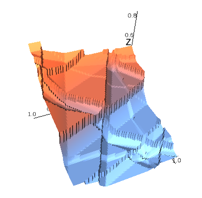
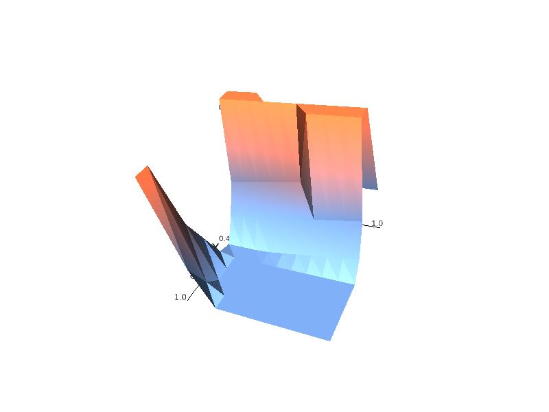
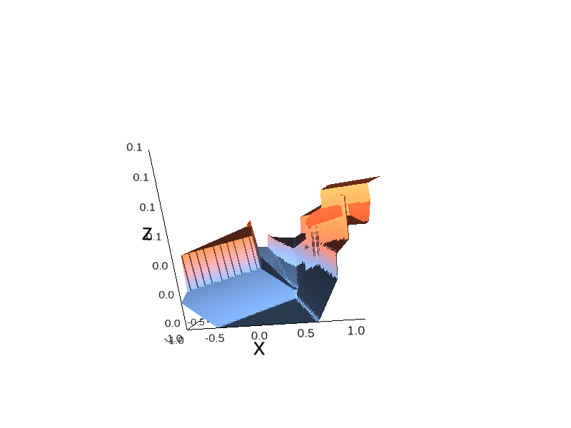

# Differentiation of Blackbox Combinatorial Solvers

By Marin Vlastelica*, Anselm Paulus*, Vít Musil, [Georg Martius](http://georg.playfulmachines.com/) and [Michal Rolínek](https://scholar.google.de/citations?user=DVdSTFQAAAAJ&hl=en).

[Autonomous Learning Group](https://al.is.tuebingen.mpg.de/), [Max Planck Institute for Intelligent Systems](https://is.tuebingen.mpg.de/).


## Table of Contents
0. [Introduction](#introduction)
0. [Installation](#installation)
0. [Content](#content)
0. [Usage](#usage)
0. [Visualizations](#visualizations)
0. [Notes](#notes)


## Introduction

This repository contains PyTorch modules that wrap blackbox combinatorial solver via the method proposed in [Differentiation of Blackbox Combinatorial Solvers](http://arxiv.org/abs/1912.02175)

*Disclaimer*: This code is a PROTOTYPE. It should work fine but use at your own risk.
 
For the exact usage of the combinatorial modules, see [wider codebase](https://sites.google.com/view/combinatorialgradients/home) 

## Installation

Simply install with pip

```
python3 -m pip install git+https://github.com/martius-lab/blackbox-backprop
```

For running the TSP module, a [manual GurobiPy installation](https://www.gurobi.com/documentation/8.1/quickstart_mac/the_gurobi_python_interfac.html) is required as well as a license

## Content

Currently, the following solver modules are available (the list will be growing over time)

| Combinatorial Problem        | Solver           | Paper  |
| ------------- |:-------------:| -----:|
| Travelling Salesman      | Cutting plane algorithm implemented in [Gurobi](https://www.gurobi.com/) | [Differentiation of Blackbox Combinatorial Solvers](http://arxiv.org/abs/1912.02175) |
| Shortest Path (on a grid)      | Dijkstra algorithm (vertex version)      |   [Differentiation of Blackbox Combinatorial Solvers](http://arxiv.org/abs/1912.02175) |
| Min-cost Perfect matching on general graphs | [Blossom V (Kolmogorov, 2009)](https://pub.ist.ac.at/~vnk/papers/blossom5.pdf)|  [Differentiation of Blackbox Combinatorial Solvers](http://arxiv.org/abs/1912.02175) |
| Ranking (+ induced Recall & mAP loss functions) | `torch.argsort` | [Blackbox Optimizationof Rank-Based Metrics](http://arxiv.org/abs/1912.02175)|
| Graph Matching | [Swoboda, 2017](http://openaccess.thecvf.com/content_cvpr_2017/html/Swoboda_A_Study_of_CVPR_2017_paper.html) | [Deep Graph Matching via Blackbox Differentiation of Combinatorial Solvers](https://arxiv.org/abs/2003.11657)|
| Multigraph Matching | [Swoboda, 2019](http://openaccess.thecvf.com/content_CVPR_2019/html/Swoboda_A_Convex_Relaxation_for_Multi-Graph_Matching_CVPR_2019_paper.html) | [Deep Graph Matching via Blackbox Differentiation of Combinatorial Solvers](https://arxiv.org/abs/2003.11657)|

The graph matching and multigraph matching solver and corresponding differentiable PyTorch modules are hosted at the [LPMP repository](https://github.com/LPMP/LPMP) 

## Usage

Exactly as you would expect of a PyTorch module (with minor details differing from solver to solver)
```python
import blackbox_backprop as bb
...
suggested_weights = ResNet18(raw_inputs)
suggested_shortest_paths = bb.ShortestPath(suggested_weights, lambda_val=5.0) # Set the lambda hyperparameter
loss = HammingLoss(suggested_shortest_paths, true_shortest_paths) # Use e.g. Hamming distance as the loss function
loss.backward() # The backward pass is handled automatically
...
```

## Visualizations

Visualizations that have appeared in the papers can be generated in the attached jupyter notebook.
This requires python packages `ipyvolume` and `ipywidgets`. Also, make sure to allow **all jupyter nbextensions** as listed [here](https://github.com/maartenbreddels/ipyvolume).

Ranking |  Shortest path  |  Graph Matching    
:-------------------------:|:-------------------------:|:-------------------------:
   |    | 


## Notes

*Contribute*: If you spot a bug or some incompatibility, raise an issue or contribute via a pull request! Thank you!